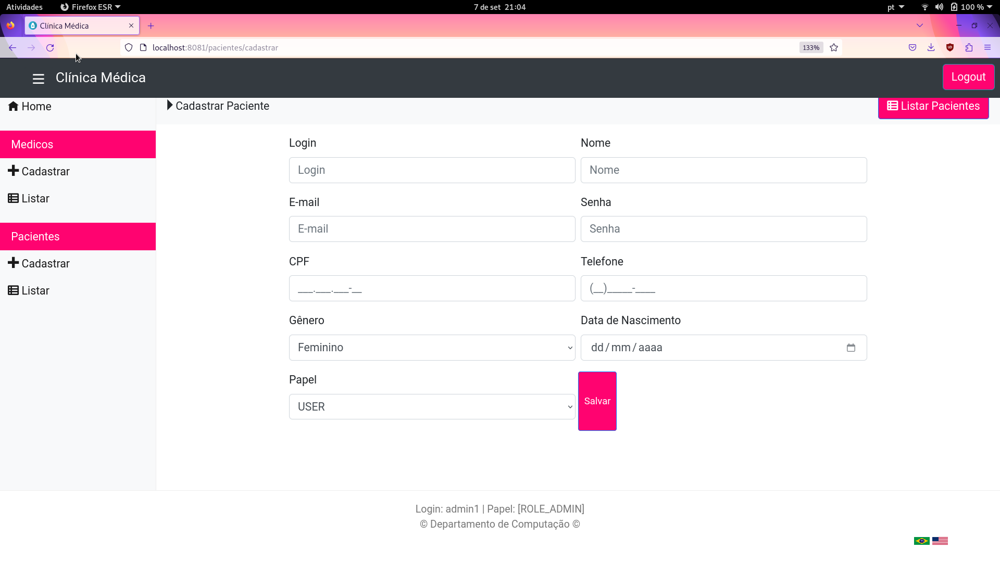
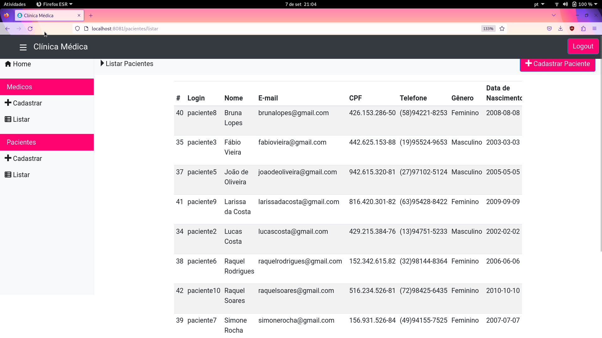

# Sistema web para agendamento de consultas médicas com Spring e Thymeleaf


Essa aplicação foi desenvolvida para a disciplina de Desenvolvimento de Software para Web 1 (DSW1) da Ufscar. Nessa versão, ele foi organizado em contâineres. O sistema foi construído na arquivetura MVC (Model-View-Controller) e usou as seguintes tecnologias: Spring MVC, Spring Data JPA, Spring Security, Thymeleaf e MySQL no lado do servidor e CSS no lado do cliente.

## Estrutura de arquivos

```
.
├── docker-compose.yml
├── infra
├── pom.xml
├── src
└── target
```

- O arquivo ```docker-compose.yml``` contém a orquestração dos contâineres da aplicação;
- A pasta ```infra``` contém os arquivos de infraestrutura;
- O arquivo ```pom.xml``` contém as dependências da aplicação;
- A pasta ```src``` contém todo o código fonte da aplicação;
- A pasta ```target``` contém as saídas geradas pela aplicação.

A aplicação contém 3 contâineres:
- database: para o banco de dados; seu Dockerfile está em ```src/main/java/br/ufscar/dc/dsw/dao/```;
- app: para o backend e o frontend; seu Dockerfile está em ```src/main/java/br/ufscar/dc/dsw/```;
- adminer: para a administração do banco de dados via UI; seu Dockerfile está em ```infra/adminer/```.

## Funcionalidades

### O sistema oferece três tipos de cadastro:
  - de pacientes, com os seguintes dados: e-mail, senha, CPF, nome, telefone, sexo e data de nascimento;
  - de médicos, com os seguintes dados: e-mail, senha, CRM, nome e especialidade;
  - de consultas, com os seguintes dados: nome do médico, CRM do médico e data/hora da consulta. A duração da consulta é de 30 minutos e sempre inicia-se em "hora cheia" ou "hora meia".

### O sistema possui as seguintes funcionalidades:
  - CRUD de médicos mediante login de administrador;
  - CRUD de pacientes mediante login de administrador;
  - Listagem de todos os médicos em uma única página;
  - Listagem de todos os médicos por especialidade;
  - Agendamento de consulta com um médico meidante login do paciente;
  - Listagem de todas as consultas de um paciente mediante login do paciente;
  - Listagem de todas as consultas de um médico mediante login do médico;
  - Internacionalização em dois idiomas: português e inglês.

## Principais telas:







## Informações para execução local:
  - É necessário ter instalado o Docker (e o docker compose);
  - Primeiro, é necessário executar o comando ```docker compose up --build``` na pasta raiz da aplicação;
  - Depois, a aplicação estará disponível na url "localhost:8080" e o banco de dados pode ser administrado via UI na url localhost:8081.

## Outras informações:
  - A equipe foi composta por 1 integrante: Giovanna Victória Rossetto, RA 791648;
  - O banco de dados está populado com 2 administradores, 10 pacientes e 30 médicos;
  - Os logins e senhas dos usuários pré-cadastrados estão no arquivo "ClinicaApplication.java" no caminho "/src/main/java/br/ufscar/dc/dsw/ClinicaApplication.java".

###### Autor: Giovanna Victória Rossetto
###### Data de criação: 17/05/2025 - 17 de maio de 2025
###### Última modificação: 17/05/2025 - 17 de maio de 2025
